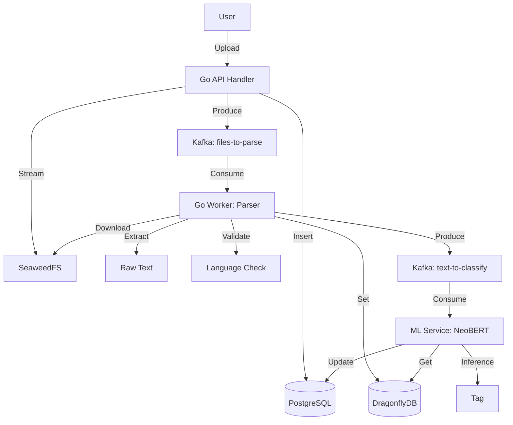

# Context: Text Processing Pipeline (NeoBERT + Kafka)

> **Purpose**: This document serves as the Source of Truth for the text classification architecture. It provides all necessary context for an AI agent to implement the system without hallucinating requirements.

## 1. System Overview

The system processes uploaded files (PDF, DOCX, TXT) to extract semantic tags using an AI model (NeoBERT). 
It uses an asynchronous, event-driven architecture to decouple file upload, text extraction, and classification.

### Core Technologies
- **Language**: Go (Parser, API), Python (ML Service)
- **Storage**: SeaweedFS (Object Store), PostgreSQL (Metadata), DragonflyDB (Cache/Intermediate Storage)
- **Messaging**: Kafka (Event Bus)
- **AI Model**: NeoBERT (English only)

## 2. Architecture Diagram



## 3. Data Models & Schemas

### 3.1 Database: `files` table
State machine for `status` column:
- `UPLOADING` -> `PROCESSING` -> `READY` | `ERROR`

```sql
CREATE TABLE files (
    id SERIAL PRIMARY KEY,
    user_id INT NOT NULL REFERENCES users(id),
    file_name TEXT NOT NULL,
    file_path TEXT NOT NULL, -- S3 path
    file_size BIGINT NOT NULL,
    file_type TEXT NOT NULL,
    status VARCHAR(20), -- NULL for generic files, or: PENDING, PROCESSING, READY, ERROR
    tag VARCHAR(50), -- Assigned by ML
    error_msg TEXT,
    created_at TIMESTAMP DEFAULT NOW()
);
```

### 3.2 Kafka Topic: `files-to-parse`
Payload for the Parser Worker.
```json
{
  "file_id": 123,
  "s3_path": "/user_1/document.pdf",
  "mime_type": "application/pdf",
  "user_id": 1
}
```

### 3.3 DragonflyDB (Redis) Schema
Temporary storage for extracted text to avoid passing large payloads through Kafka.
- **Key**: `text:{file_id}`
- **Value**: "Raw extracted text content..."
- **TTL**: 24 hours

### 3.4 Kafka Topic: `text-to-classify`
Payload for the ML Service.
```json
{
  "file_id": 123,
  "cache_key": "text:123",
  "request_id": "uuid-v4"
}
```

## 4. Component Logic (The "Prompt" for Implementation)

### Component A: file_upload.go (API)
**Responsibility**: Receive file, validate magic bytes, save to S3, trigger initial event.
**Constraints**:
- Must verify magic bytes (already implemented).
- Must calculate file hash for deduplication.
- **Transactionality**: S3 Upload -> DB Insert -> Kafka Publish.
  - IF S3 fails: Return Error, do not touch DB.
  - IF DB fails: Delete from S3 (best effort), Return Error.
  - IF Kafka fails: Log Error (or use Outbox pattern for 100% reliability), but return 200 OK to user (since file is saved).
- **Security**: S3 connections use local/internal networking.

### Component B: Parser Worker (Go)
**Responsibility**: Convert binary formats to text.
**Libraries**: `pdfcpu` (PDF), `unidoc` or `xml` (DOCX), `lingua` (Language Detection).
**Logic**:
1. Consume `files-to-parse`.
2. Stream file from S3.
3. Extract text.
4. **Validation**:
   - IF text length < 50 chars -> Status `ERROR` ("No text found").
   - IF language != English -> Status `ERROR` ("Unsupported language").
5. Save text to DragonflyDB.
   - Command: `SETEX text:{id} 86400 "content"`
6. Produce to `text-to-classify` (Kafka).
7. Handle errors: Update DB status to `ERROR`, log error.

### Component C: ML Service
**Responsibility**: run NeoBERT inference.
**Logic**:
1. Consume `text-to-classify` (Kafka).
2. Retrieve text from DragonflyDB using `cache_key`.
3. IF key missing -> Retry/Error (TTL expired).
4. Run Model.
5. Update `files` table (Postgres): `SET status='READY', tag='{predicted_tag}' WHERE id={file_id}`.
6. **Mandatory**: Delete Redis key (`DEL text:{id}`).

## 5. Security & Constraints
- **Internal Networking**: Services communicate over plain HTTP/TCP for dev/test.
- **Max File Size**: 
  - Text-based for ML: 12MB.
  - General files: 2GB.
- **Retries**: Kafka consumer must handle temporary DB/Redis failures with exponential backoff.
